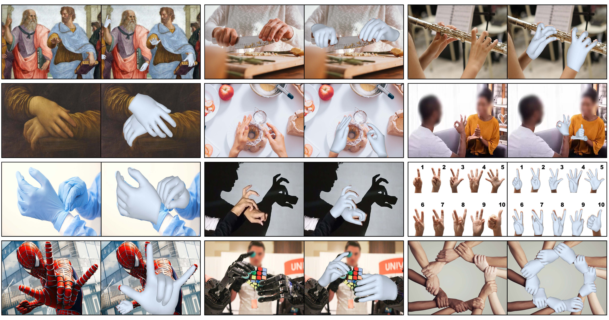
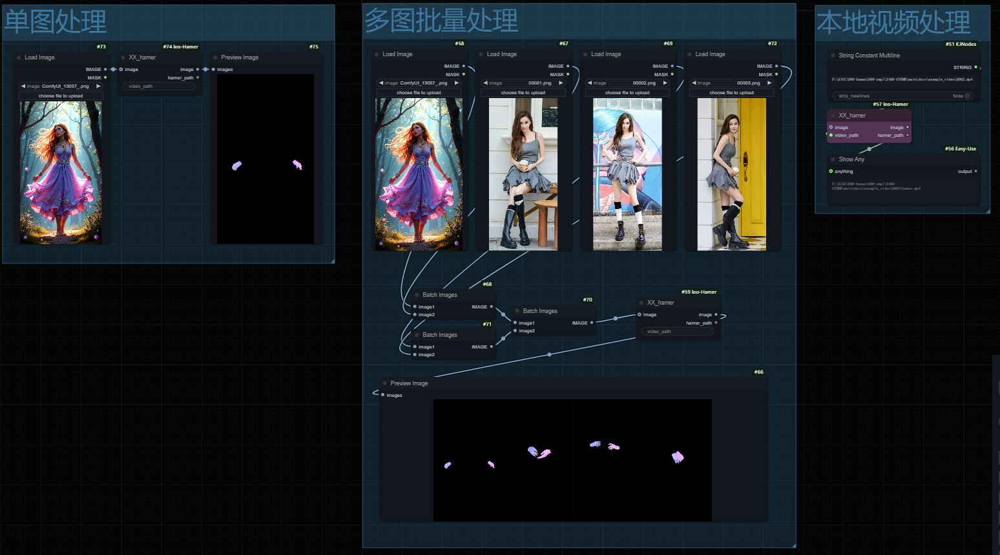

# Unoffice Hamer-ComfyUI by leo 
base on [hamer](https://github.com/geopavlakos/hamer) ,基于此项目  
  
  

project consists of one nodes,  supports single-image, batch image, and video (input local address) 3D hand inference, similar to the MeshGraphormer hand inference model  
含一个推理节点 ，支持单图，多图，视频(输入本地地址)3d手部推理，类似MeshGraphormer手部推理模型  
  
* workflows  
The usage is simple, please refer to the workflow file  
用法简单，可参考workflows文件夹下的工作流文件  
  
## 安装  
Installation and models download, please referred to [hamer](https://github.com/geopavlakos/hamer)  
相关模型下载及依赖，可参考[hamer](https://github.com/geopavlakos/hamer)  

you can change model path in infer.py  
infer.py可配置模型地址  